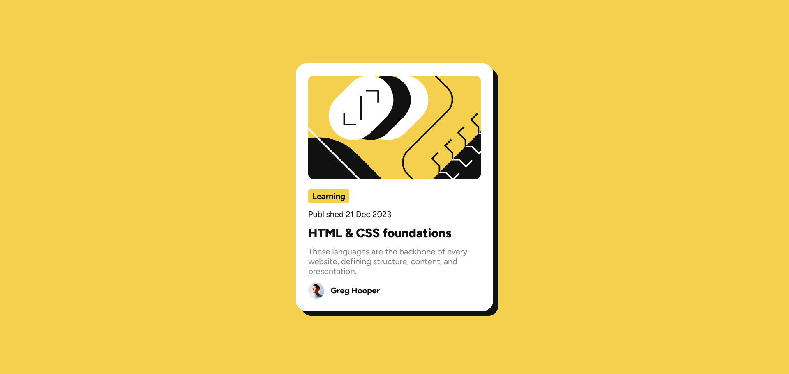

# Frontend Mentor - Blog preview card solution

This is a solution to the [Blog preview card challenge on Frontend Mentor](https://www.frontendmentor.io/challenges/blog-preview-card-ckPaj01IcS). Frontend Mentor challenges help you improve your coding skills by building realistic projects. 

## Table of contents

- [Overview](#overview)
  - [The challenge](#the-challenge)
  - [Screenshot](#screenshot)
  - [Links](#links)
- [My process](#my-process)
  - [Built with](#built-with)
- [Author](#author)

## Overview

### The challenge

Users should be able to:

- See hover and focus states for all interactive elements on the page

### Screenshot

### Links

- Solution URL: [Github](https://github.com/Sazid99246/frontend-mentor-blog-preview-card-component)
- Live Site URL: [Blog Preview Card Component](https://6666649334f103594dd690ff--legendary-bienenstitch-274ac4.netlify.app/)

## My process

### Built with

- Semantic HTML5 markup
- Flexbox

## Author

- Website - [Sheikh Md. Sazidul Islam](https://my-portfolio-d6429.web.app/)
- Frontend Mentor - [@Sazid99246](https://www.frontendmentor.io/profile/Sazid99246)
